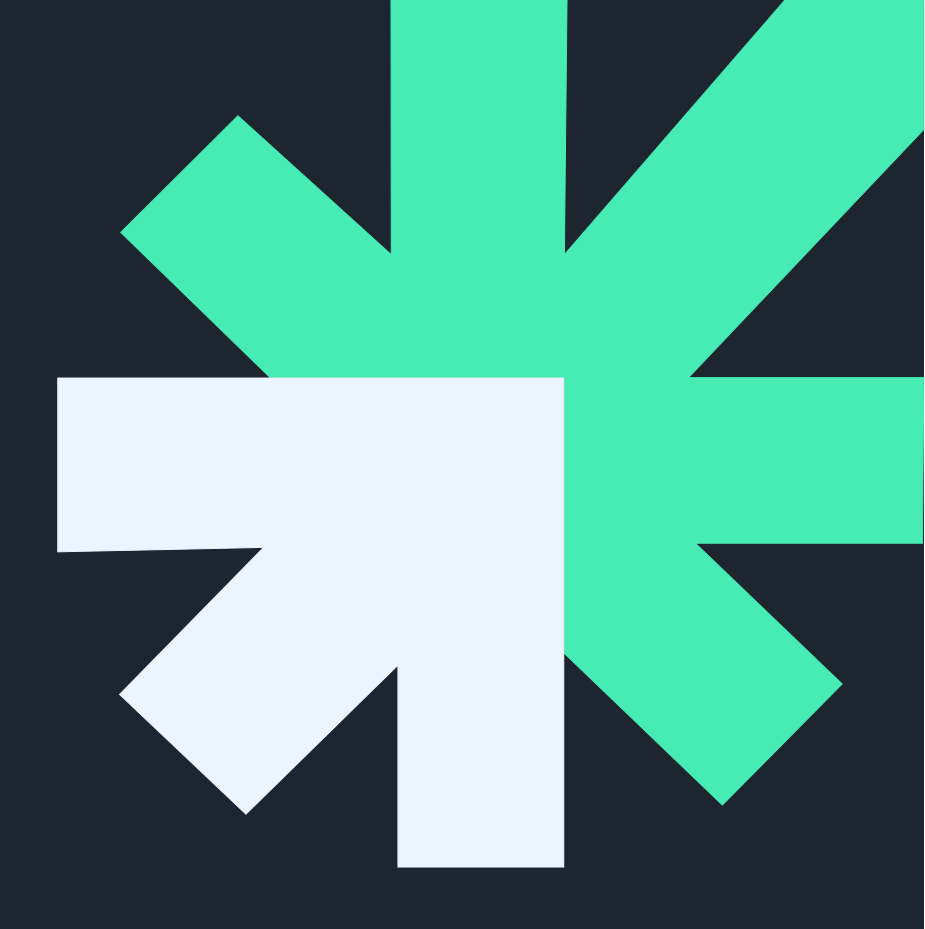

 

  
  <h2 align="center">Quantum UBB - Branding Oficial</h2>

Aqui encontraras todos los recursos necesarios para que puedas crear tus proyectos con la firma visual del grupo Quantum de la Universidad del Bío bío. 

  <a href="https://quantumubb.com">Themes</a>
  ·
  <a href="https://quantumubb.com/palette">Palette</a>
  ·
  <a href="https://github.com/quantumubb/.github/blob/main/contributing.md">Contributing</a>

    

## Recursos

- [New theme template](https://github.com/quantumubb/quantumubb-template)
- [Social image generator](https://quantumubb-images.vercel.app)
- [Brand assets](https://github.com/quantumubb/quantumubb-theme/tree/main/assets)
- [Palette tool](https://github.com/quantumubb/palette)

## Redes Sociales

- [Página Web](https://www.quantumubb.cl/)
