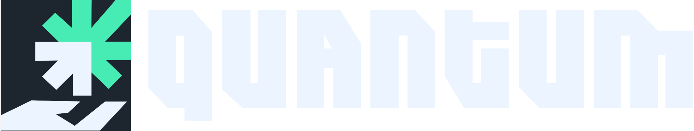

 

  

Aquí encontrarás todos los recursos necesarios para que puedas crear tus proyectos con la firma visual del grupo Quantum de la Universidad del Bío bío. No dudes en contactarnos si tienes alguna duda o sugerencia. 

    

## Recursos

- [Paleta de Colores](https://github.com/BenjaminAGH/QuantumBranding/tree/main/assets/colors)
- [Logos](https://github.com/BenjaminAGH/QuantumBranding/tree/main/logos)

## Redes Sociales

- [Página Web](https://www.quantumubb.cl/)
